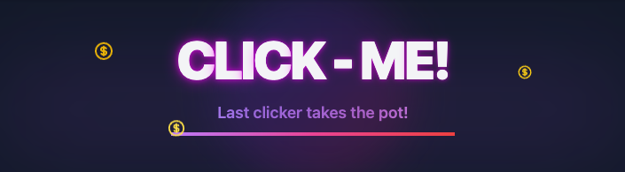

# ClickMe Game - Solana dApp



## Overview

ClickMe is an interactive web3 game built on Solana where players compete to be the last person to click a button when a timer expires. The game features:

- **Real-time competition**: Each game runs with a 3-minute timer that resets on every click
- **Increasing costs**: Each click raises the price for the next click
- **Winner-takes-all**: The last person to click the button when the timer expires wins the entire pot
- **Staking mechanics**: Earn passive rewards by staking your tokens

## Table of Contents

- [Technologies](#technologies)
- [Project Structure](#project-structure)
- [Setup and Installation](#setup-and-installation)
- [Game Rules](#game-rules)
- [Local Development](#local-development)
- [Deployment](#deployment)
- [Contributing](#contributing)
- [License](#license)

## Technologies

- **Frontend**: Next.js, React, TypeScript, TailwindCSS
- **Blockchain**: Solana, Anchor Framework
- **UI Components**: Custom animations, responsive design
- **State Management**: React Hooks and custom state management

## Project Structure

```
/
├── src/
│   ├── app/                         # Next.js App Router
│   │   ├── layout.tsx               # Root layout component
│   │   ├── page.tsx                 # Home page component
│   │   ├── globals.css              # Global styles
│   │   └── react-query-provider.tsx # React Query context
│   │
│   ├── components/                  # UI components
│   │   ├── button-game/             # Game components
│   │   │   ├── ActionButton.tsx     # Button component for game actions
│   │   │   ├── ButtonGame.tsx       # Main game component
│   │   │   ├── GameMetrics.tsx      # Game stats display
│   │   │   ├── GameRules.tsx        # Rules display component
│   │   │   └── ...                  # Other game components
│   │   │
│   │   ├── Footer/                  # Footer components
│   │   ├── GameMechanicsPopup/      # Game rules popup
│   │   ├── Header/                  # Header components
│   │   ├── MenuPortal/              # Menu overlay components
│   │   ├── solana/                  # Solana connection components
│   │   ├── StakingInterface/        # Staking UI components
│   │   ├── styles/                  # Component-specific styles
│   │   └── ui/                      # Reusable UI components
│   │
│   ├── config/                      # Configuration files
│   │   ├── button-config.json       # Game configuration
│   │   ├── index.ts                 # Config exports
│   │   └── staking-config.json      # Staking configuration
│   │
│   ├── hooks/                       # Custom React hooks
│   │   ├── useButtonGame.tsx        # Main game hook
│   │   └── useHeaderButton.ts       # Header interaction hook
│   │
│   ├── idl/                         # Solana program interfaces
│   │   ├── button_game.json         # Game program IDL
│   │   └── staking_program.json     # Staking program IDL
│   │
│   └── lib/                         # Utility libraries
│       ├── staking/                 # Staking implementation
│       │   ├── services/            # Staking service modules
│       │   ├── utils/               # Staking utilities
│       │   ├── index.ts             # Staking exports
│       │   └── StakingClient.ts     # Main staking client
│       │
│       ├── ButtonGameClient.ts      # Game client implementation
│       ├── types.ts                 # Type definitions
│       └── utils.ts                 # Utility functions
│
├── .env.local                       # Local environment variables
├── next.config.mjs                  # Next.js configuration
├── package.json                     # Dependencies and scripts
├── tailwind.config.ts               # Tailwind CSS configuration
└── tsconfig.json                    # TypeScript configuration
```

## Setup and Installation

### Prerequisites

- Node.js v16+ and npm/yarn
- Solana CLI tools (optional for local development)
- A Solana wallet (Phantom, Solflare, etc.)

### Installation

1. Clone the repository:
   ```bash
   git clone https://github.com/your-username/clickme-game.git
   cd clickme-game
   ```

2. Install dependencies:
   ```bash
   npm install
   # or
   yarn install
   ```

3. Set up environment variables:
   Create a `.env.local` file with the following variables:
   ```
   # Required: Solana RPC URL for your network
   NEXT_PUBLIC_SOLANA_RPC_URL=https://mainnet.helius-rpc.com/?api-key=YOUR_API_KEY
   
   # Optional: Override network (mainnet or devnet, defaults to mainnet)
   # NEXT_PUBLIC_NETWORK=mainnet
   
   # Optional: Override program IDs (defaults to values in config JSON files)
   # NEXT_PUBLIC_BUTTON_GAME_PROGRAM_ID=YOUR_GAME_PROGRAM_ID
   # NEXT_PUBLIC_STAKING_PROGRAM_ID=YOUR_STAKING_PROGRAM_ID
   
   # Optional: Feature flags
   # NEXT_PUBLIC_TOKEN_LIVE=false
   ```

4. Start the development server:
   ```bash
   npm run dev
   # or
   yarn dev
   ```

5. Open your browser and navigate to `http://localhost:3000`

## Game Rules

1. **Starting a Game**: Anyone can start a new game by paying the initial cost (currently set at 0.05 SOL)
2. **Clicking the Button**: 
   - First click costs 0.01 SOL
   - Each click adds to the pot and resets the timer to 3 minutes
   - Each click increases the next click cost by 0.01 SOL
3. **Winning**: When the timer expires, the last person to click wins the entire pot
4. **Rewards**: Rewards are paid out when the next game starts

## Local Development

### Running with local Solana validator

1. Install Solana CLI tools:
   ```bash
   sh -c "$(curl -sSfL https://release.solana.com/v1.14.17/install)"
   ```

2. Start a local validator:
   ```bash
   solana-test-validator
   ```

3. Update your `.env.local` to point to the local validator:
   ```
   NEXT_PUBLIC_SOLANA_RPC_URL=http://localhost:8899
   ```

4. Deploy the program to your local validator (optional, requires the program source):
   ```bash
   cd program
   anchor build
   anchor deploy
   ```

5. Start the development server:
   ```bash
   npm run dev
   ```

### Working with the Staking System

The staking system allows users to stake tokens and earn rewards. To integrate with the staking system:

1. Import the staking client:
   ```typescript
   import { StakingClient } from '@/lib/staking';
   ```

2. Initialize with a provider:
   ```typescript
   const stakingClient = new StakingClient(provider);
   ```

3. Use the client methods for staking operations:
   ```typescript
   // Stake tokens
   await stakingClient.stakeTokens(new BN(amount));
   
   // Unstake tokens
   await stakingClient.unstakeTokens(new BN(amount));
   
   // Claim rewards
   await stakingClient.claimRewards();
   ```

## Deployment

### Deploying to Production

1. Build the project:
   ```bash
   npm run build
   # or
   yarn build
   ```

2. Start the production server:
   ```bash
   npm start
   # or
   yarn start
   ```

### Deploying to Vercel or Fleek

1. Push your code to GitHub
2. Import your GitHub repository to Vercel or Fleek
3. Set up environment variables in the respective dashboard:

   **For Fleek:**
   - Navigate to Hosting > [Your Site] > Settings
   - Scroll to "Build Settings" section
   - Find "Environment Variables" and add at minimum:
     ```
     NEXT_PUBLIC_SOLANA_RPC_URL=https://mainnet.helius-rpc.com/?api-key=YOUR_API_KEY
     ```
   - Add any other environment variables needed to override defaults
   - Save changes and trigger a new deployment

   **For Vercel:**
   - Go to your project dashboard
   - Navigate to Settings > Environment Variables
   - Add the same variables as above
   - Deploy or redeploy your project

4. Your app will build with the configured environment settings

## Contributing

We welcome contributions! Please feel free to submit a Pull Request.

1. Fork the repository
2. Create your feature branch (`git checkout -b feature/amazing-feature`)
3. Commit your changes (`git commit -m 'Add some amazing feature'`)
4. Push to the branch (`git push origin feature/amazing-feature`)
5. Open a Pull Request

## License

This project is licensed under the MIT License - see the LICENSE file for details.

---

Built with ❤️ for the Solana ecosystem